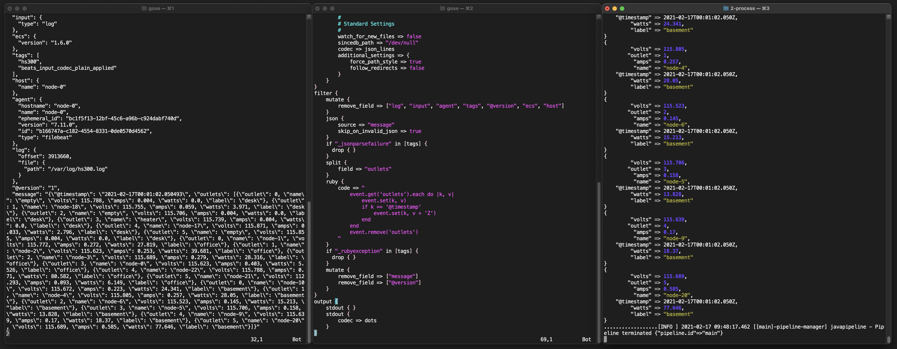

# Logstash Toolkit


Logstash processes data using pipelines.  Below is a method for iteratively building Logstash pipelines.  It's outlined in 3 simple steps:

1. Print events to `stdout` to verify we can read them
2. Add a [Logstash Filter](https://www.elastic.co/guide/en/logstash/current/filter-plugins.html) to the `filter` block to modify the structure
3. Repeat Step #2 until your records are structured

The goal is to build a series of filters inside the `filter` block, which will turn the unstructured or semi-structured data into a structured format.

One approach to following these steps is to setup three terminals, side-by-side, and open the following in each:

* Terminal 1 - Source record that we'll use to reference existing structure
* Terminal 2 - Our Logstash pipeline so we can slowly add `filters`
* Terminal 3 - Shell to run Logstash which will reflect the new structure after being filtered



In the above example, you can see the raw record on the left, the filter chain in the middle, and the structured output on the right.  Building a `filter` chain in Logstash is largely an exercise in referencing the [Logstash Filters](https://www.elastic.co/guide/en/logstash/current/filter-plugins.html) documentation to see what is available, how they behave, and options they take.

Start with an empty filter chain:

```
filter {
}
```

Verify that the `stdout` output plugin is able to print records to `stdout` without any filtering.  Then add your first filter:

```
filter {
    add_field => {
    	"foo" => "bar"
    }
}
```

When you save the `test.yml` file, Logstash will pick up the change and re-run the filters in the file.  This should give you an "iteration loop" to run over and over as you build your `filter` chain.

Logstash has the ability to [add conditionals and use variables](https://www.elastic.co/guide/en/logstash/current/event-dependent-configuration.html).  Once you become familiar with the syntax, you'll find it quite powerful with regards to pulling apart data and structuring it the way you want it.

